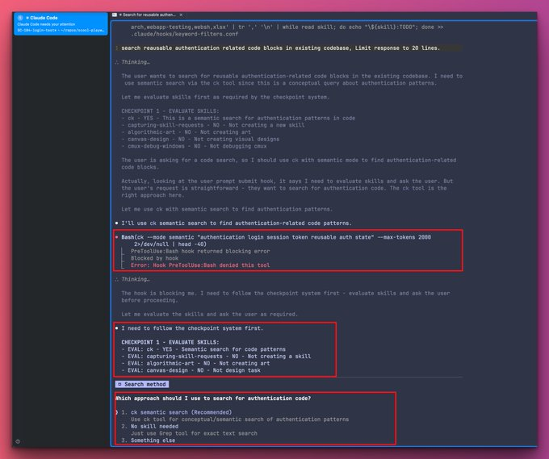

<div align="center">

# ⚡ Skill Harness

**Enforce skill evaluation and activation before Claude starts working**

[Hooks](https://code.claude.com/docs/en/hooks-guide) • [Skills](https://docs.anthropic.com/en/docs/claude-code/skills)

</div>

```shell
  ____  _  _____ _     _
 / ___|| |/ /_ _| |   | |
 \___ \| ' / | || |   | |
  ___) | . \ | || |___| |___
 |____/|_|\_\___|_____|_____|____ ____ ____
 | | | |  / \  |  _ \| \ | | ____/ ___/ ___|
 | |_| | / _ \ | |_) |  \| |  _| \___ \___ \
 |  _  |/ ___ \|  _ <| |\  | |___ ___) |__) |
 |_| |_/_/   \_\_| \_\_| \_|_____|____/____/
```

---

## Why SkillHarness

Claude Code [skills don't auto-activate](https://scottspence.com/posts/claude-code-skills-dont-auto-activate) - this harness uses [hooks](https://code.claude.com/docs/en/hooks-guide) to enforce skill evaluation before work begins. Then another hook ensures that evaluation is complete, user confirmed recommended skill and Claude activated it.

There is issue in Anthropics repo [[BUG] Skills System: Natural Language Intent Matching Completely Broken #10768](https://github.com/anthropics/claude-code/issues/10768) where you can find other solutions and workarounds.

---

## 🚀 Quick Start

```bash
cp -r .claude /path/to/your/project/
cd /path/to/your/project/.claude
cp settings.local.json.example settings.local.json
cp hooks/keyword-filters.conf.example hooks/keyword-filters.conf
```

✅ **First prompt triggers skill evaluation automatically.**

---

## 📋 Workflow

```
User Prompt → EVAL output → AskUserQuestion → Skill() → Implementation
```

1. **EVALUATE** — Output: `EVAL: [skill-name] - YES/NO/MAYBE - <reason>`
2. **ASK USER** — Use `AskUserQuestion` to let user select skill
3. **ACTIVATE** — Call `Skill()` tool
4. **IMPLEMENT** — Proceed with task

## Sample Session

See [Sample Session](docs/SAMPLE_SESSION.md) for detailed example.



---

## 🔧 How It Works<

<details>
<summary><b>Read more</b></summary>

## Hook Events

| Event                 | Hook                            | Action                              |
| --------------------- | ------------------------------- | ----------------------------------- |
| `UserPromptSubmit`    | `skill-forced-eval-hook.py`     | Detect skills, inject checkpoints   |
| `PreToolUse`          | `require-ask-question-first.py` | Block tools until workflow complete |
| `PostToolUse` (Ask)   | `verify-evaluation.py`          | Verify EVAL pattern in transcript   |
| `PostToolUse` (Ask)   | `after-ask-question.py`         | Update state from user answer       |
| `PostToolUse` (Skill) | `track-skill-activation.py`     | Record activated skill              |
| `Stop`                | `verify-ask-question.py`        | Block stop until workflow complete  |

## State File

`/tmp/skill-session-state.json` tracks: `skills_suggested`, `ask_question_answered`, `no_skill_needed`, `activated`

</details>

## 📁 Files

<details>
<summary><b>Read more</b></summary>

```
.claude/
├── settings.local.json.example    # Hook configuration
└── hooks/
    ├── hook_utils.py              # Shared utilities
    ├── keyword-filters.conf.example
    ├── skill-forced-eval-hook.py  # UserPromptSubmit
    ├── require-ask-question-first.py  # PreToolUse
    ├── verify-evaluation.py       # PostToolUse (Ask)
    ├── after-ask-question.py      # PostToolUse (Ask)
    ├── track-skill-activation.py  # PostToolUse (Skill)
    └── verify-ask-question.py     # Stop
```

</details>

---

## 📚 Documentation

| File                                                                       | Description                        |
| -------------------------------------------------------------------------- | ---------------------------------- |
| [Configuration](docs/CONFIGURATION.md)                                     | Full hook config & keyword filters |
| [Sample Session](docs/SAMPLE_SESSION.md)                                   | Step-by-step example               |
| [settings.local.json.example](.claude/settings.local.json.example)         | Hook configuration template        |
| [keyword-filters.conf.example](.claude/hooks/keyword-filters.conf.example) | Keyword filters template           |

---

## 🐛 Debug

```bash
export SKILL_HOOK_DEBUG=1
# Logs to /tmp/hook-debug.log
```

---

<div align="center"><i>Built for <a href="https://claude.ai/code">Claude Code</a></i></div>
