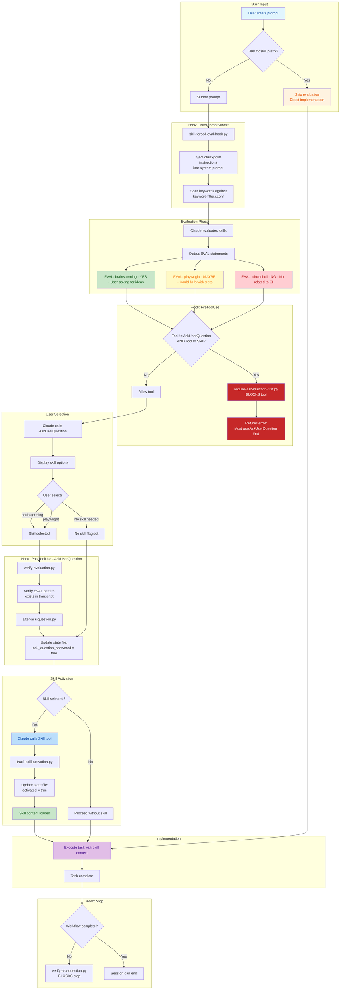

# Skill Harness Process Flow Diagram

Step-by-step workflow from user prompt to implementation.



## Example Flow (from SAMPLE_SESSION.md)

```
User: suggest 1 idea for improving home page tests

                    ↓
┌─────────────────────────────────────────────────────────────────┐
│ Claude evaluates skills and outputs:                            │
│                                                                 │
│   EVAL: brainstorming - YES - User is asking for improvement   │
│   EVAL: playwright - MAYBE - Could help with test patterns     │
│   EVAL: testing-anti-patterns - MAYBE - Could inform           │
│   EVAL: condition-based-waiting - NO - Too specific            │
│   EVAL: circleci-cli - NO - Not related to CI                  │
└─────────────────────────────────────────────────────────────────┘
                    ↓
┌─────────────────────────────────────────────────────────────────┐
│ AskUserQuestion: Which skill should I use?                      │
│                                                                 │
│ Options:                                                        │
│ • brainstorming (Recommended)                                   │
│ • playwright skill                                              │
│ • No skill needed                                               │
└─────────────────────────────────────────────────────────────────┘
                    ↓
┌─────────────────────────────────────────────────────────────────┐
│ User selects: brainstorming (Recommended)                       │
└─────────────────────────────────────────────────────────────────┘
                    ↓
┌─────────────────────────────────────────────────────────────────┐
│ Skill(brainstorming) activated                                  │
│                                                                 │
│ Claude follows brainstorming workflow:                          │
│ • Phase 1: Understanding - asks clarifying questions            │
│ • Phase 2: Exploration - proposes approaches                    │
│ • Phase 3: Design - presents solution incrementally             │
└─────────────────────────────────────────────────────────────────┘
                    ↓
               Implementation
```

## Hook Execution Order

| Event | Hook File | Purpose |
|-------|-----------|---------|
| `UserPromptSubmit` | `skill-forced-eval-hook.py` | Inject evaluation instructions |
| `PreToolUse` | `require-ask-question-first.py` | Block tools until AskUserQuestion used |
| `PostToolUse` (Ask) | `verify-evaluation.py` | Confirm EVAL pattern exists |
| `PostToolUse` (Ask) | `after-ask-question.py` | Update state from user answer |
| `PostToolUse` (Skill) | `track-skill-activation.py` | Record activated skill |
| `Stop` | `verify-ask-question.py` | Block stop until workflow complete |
