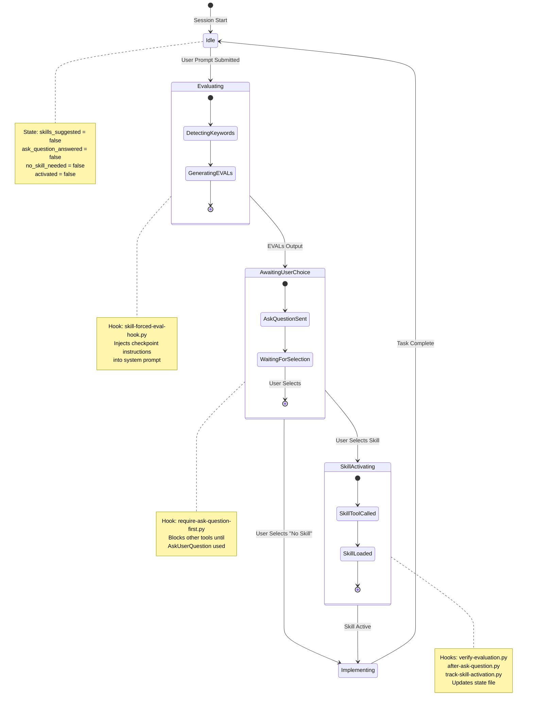

# Skill Harness State Diagram

State machine for the skill evaluation and activation workflow.

## State Descriptions

| State | Description | State File Values |
|-------|-------------|-------------------|
| **Idle** | Waiting for user input | All flags `false` |
| **Evaluating** | Detecting skills from keywords, generating EVAL outputs | `skills_suggested` → `true` |
| **AwaitingUserChoice** | AskUserQuestion displayed, waiting for user selection | `ask_question_answered` → `true` after selection |
| **SkillActivating** | Skill tool called, skill content loaded | `activated` → `true` |
| **Implementing** | Task execution with active skill | Active skill context loaded |

## Transitions

1. **User Prompt** → Triggers `UserPromptSubmit` hook → Injects evaluation instructions
2. **EVAL Output** → Claude outputs skill evaluations → Must use AskUserQuestion
3. **User Selection** → Updates state file → Allows Skill tool or direct implementation
4. **Skill Activation** → Loads skill context → Proceeds with task
